CHRISTMAS PARTY!

# We're Back for 2025!

# Join us for our Christmas Party, in-person and on Zoom!

Yes, the famous Austin Amateur Radio Club Christmas Party is back, with all the usual contests, recognition awards and plenty of door prizes! There’ll be lots of fun and socializing, too!

**The club is covering the cost of a buffet dinner for club members and your spouse/significant other! If you’re not yet a club member, [now would be a great time to become one!](/join/)**

To celebrate our getting together, the club is covering the cost of a buffet dinner (entree, appetizer & non-alcoholic beverage~~\*~~) for club members and your spouse/significant other!

The [Buffet King, aka “China Buffet” options feature a wide variety of tasty food choices.](https://buffetkingaustintexas.com/23875)

So, yes: Free Food! 😉  Sign Up at the bottom of this page!

~~\* Hard drinks are the responsibility of each person ordering them, along with appropriate gratuity for drink service.~~ Sorry: no alcohol at Buffet King.

And while we had a problem with audio on our Zoom broadcast last year, we’re going to give it another go this year, hopefully with better results!

**So, yes: Free Food!  😉 Sign Up at the bottom of this page!**

## QLF? "Are you sending with your left foot?"

The QLF contest (morse code with your left foot, or non-dominant foot, Lew!) will again take place, with the winner receiving the highly-coveted QLF trophy!

## Grand Door Prize!

Our top door prize this year is a [Yaesu FTM-310D 50W Dual-Band C4FM Analog/Digital Mobile Transceiver](/yeasu-ftm-310d-brochure/), with real dual-band operation, a full-color screen, built-in Bluetooth, APRS/GPS, WiRES-X (Yaesu Fusion Digital), and a removable faceplate, amongst other features, (a $500 value!), which will be awarded to one lucky winner.

## White Elephant Gift Exchange!

We’ll have it again this year! The White Elephant gift exchange works like this:

1.  Bring something that’s wrapped and ham-radio-related, worth at least $10, and works or is usable just like it is.
2.  Get a numbered ticket for the exchange drawing.
3.  When your ticket number is called, either select a remaining gift and open it, or “steal” a previously opened gift. But a “theft” is only allowed once per recipient. If your selection is “stolen”, you immediately get a new selection.

Gifts might include a cheap used radio, a vacuum tube, antenna wire or insulators, a book, a microphone, a hand tool, etc. Homebrew items are OK too, _if they work._

Artistic creations could be entered too, but they must meet the requirements in number 1 above.

So, what’ya got?? Please indicate in the “Comments” block on the Sign-up! form below if you plan to bring a White Elephant gift.

[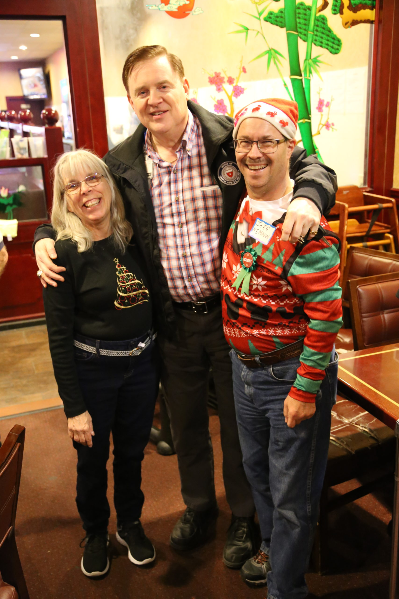](AARC-Christmas-Party-2018-IMG_5009-scaled-1500x2250.jpg)

[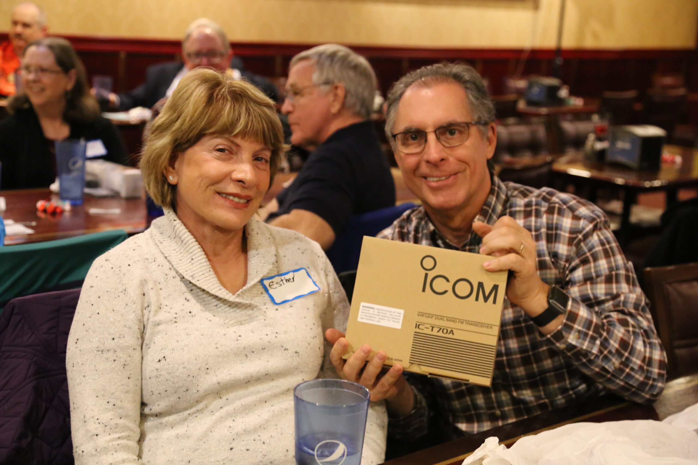](AARC-Christmas-Party-2018-IMG_4876-scaled-1500x1000.jpg)

[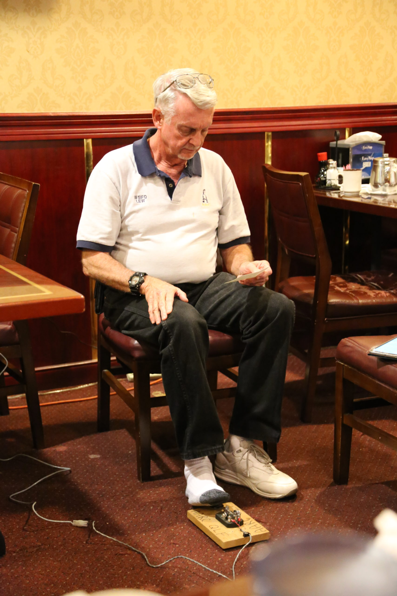](AARC-Christmas-Party-2018-IMG_4736-scaled-1500x2250.jpg)

[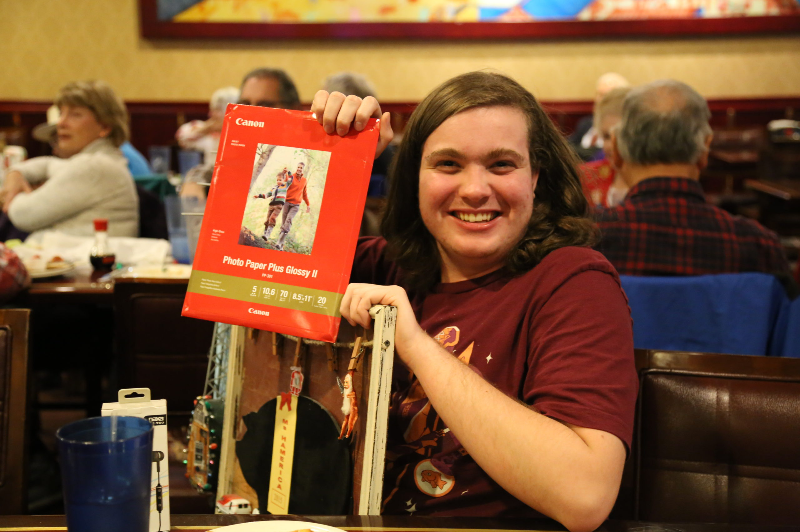](AARC-Christmas-Party-2018-IMG_4860-scaled-1500x1000.jpg)

[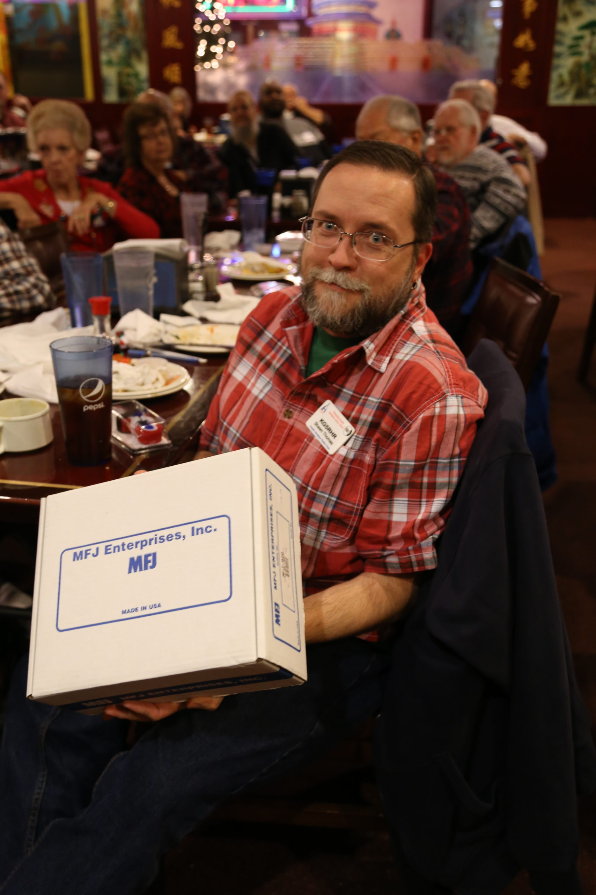](AARC-Christmas-Party-2018-IMG_4849-scaled-1500x2250.jpg)

[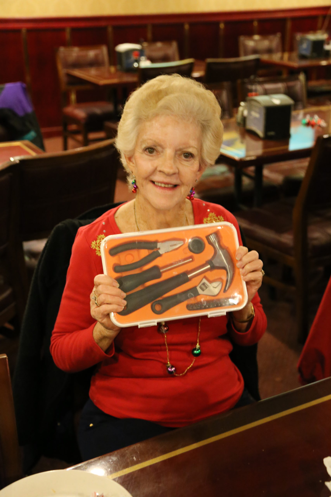](AARC-Christmas-Party-2018-IMG_4910-scaled-1500x2250.jpg)

[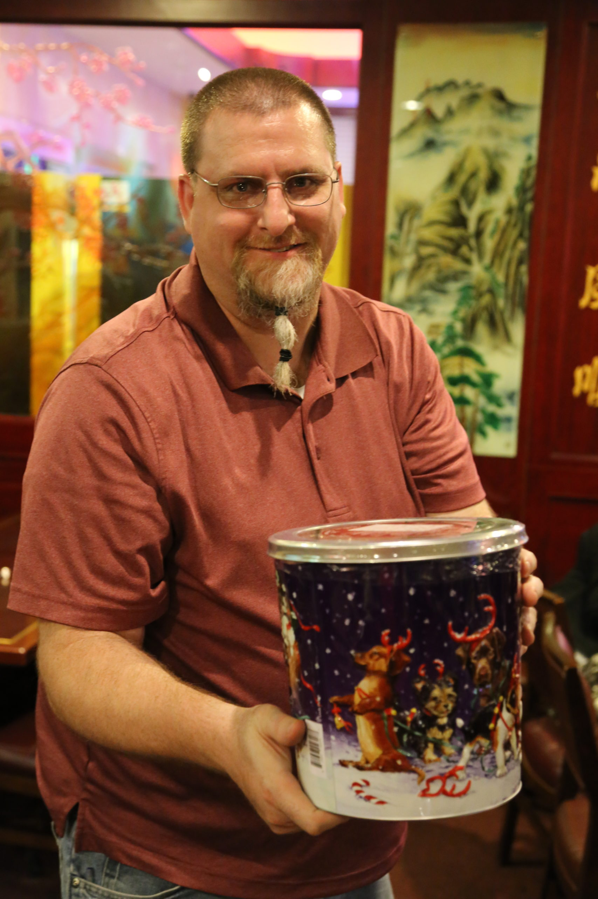](AARC-Christmas-Party-2018-IMG_4833-scaled-1500x2250.jpg)

[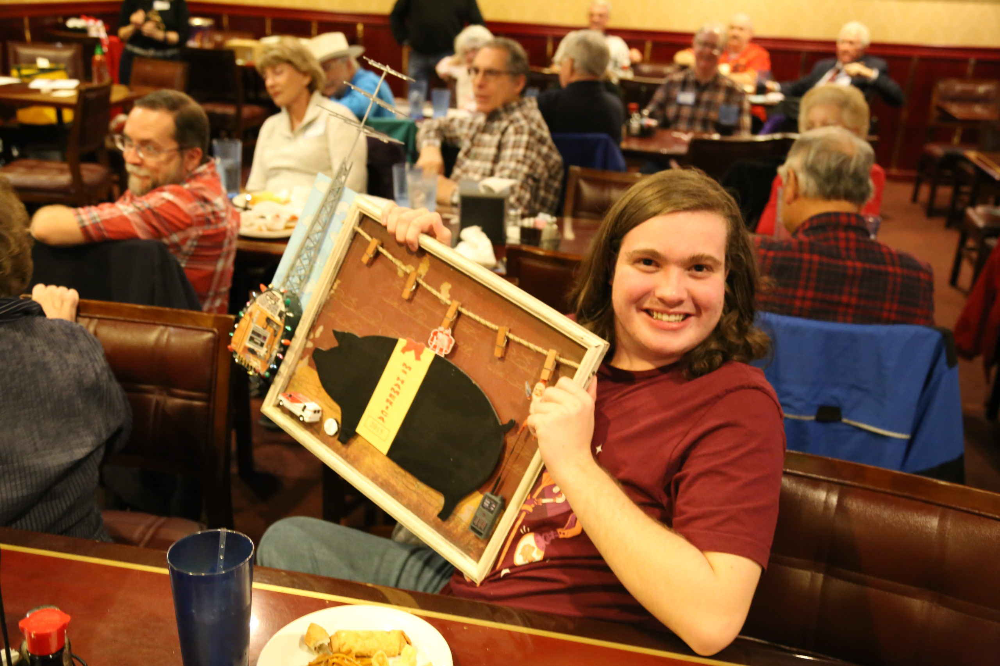](AARC-Christmas-Party-2018-IMG_4787-scaled-1500x1000.jpg)

[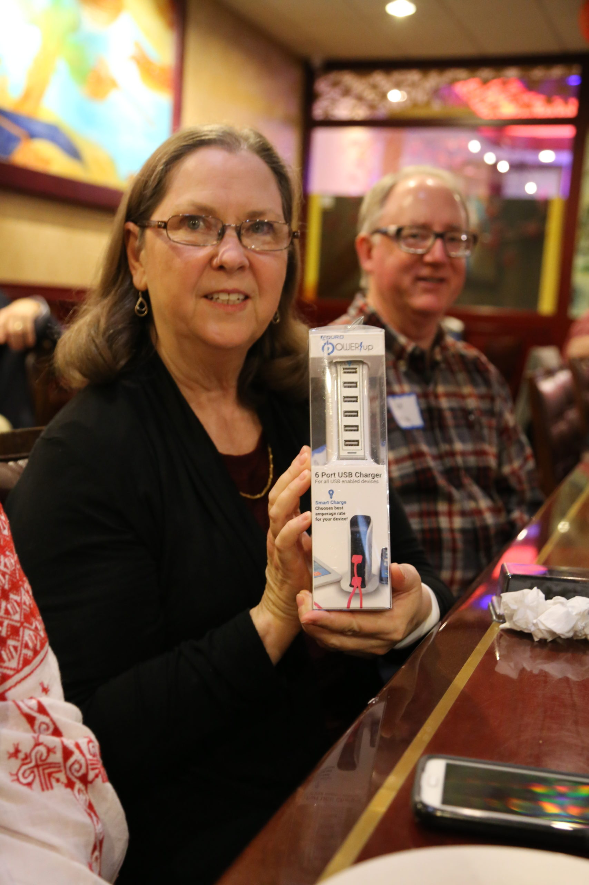](AARC-Christmas-Party-2018-IMG_4772-scaled-1500x2250.jpg)

[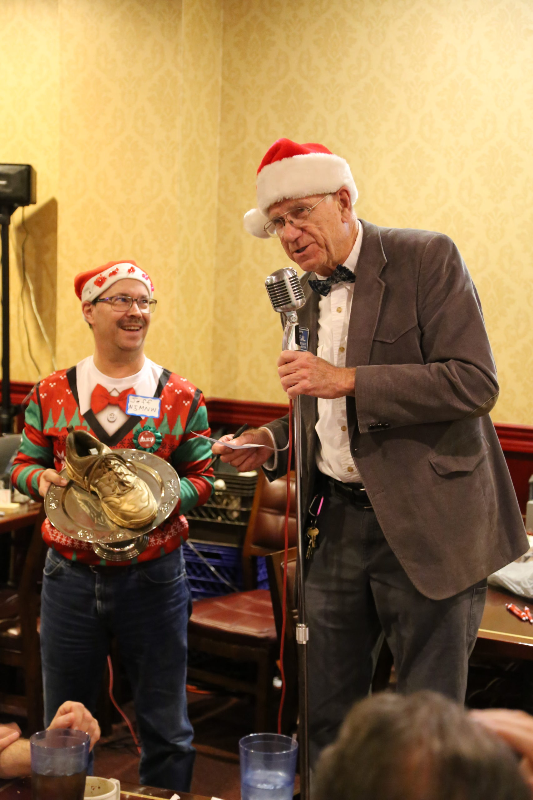](AARC-Christmas-Party-2018-IMG_4752-scaled-1500x2250.jpg)

[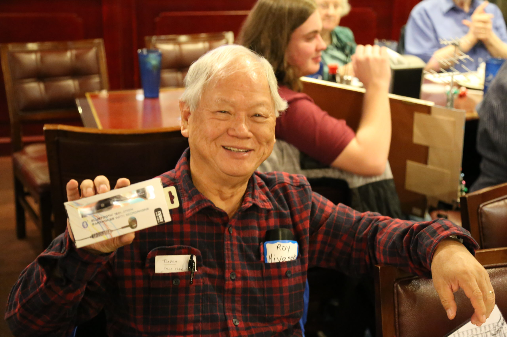](AARC-Christmas-Party-2018-IMG_4790-scaled-1500x1000.jpg)

[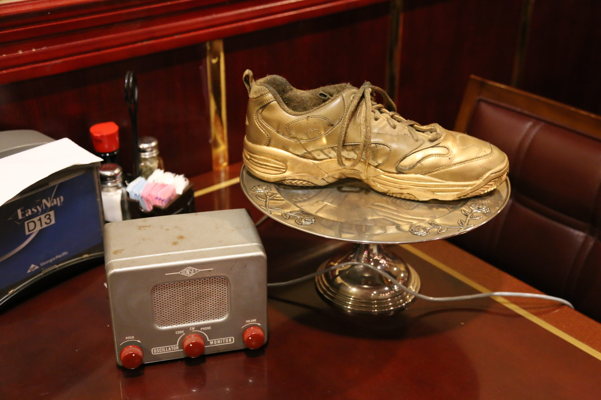](AARC-Christmas-Party-2018-IMG_4719-scaled-1500x1000.jpg)

## Location

The 2025 Christmas Party will be held at the Buffet King Chinese restaurant (aka “China Buffet”) in the back corner of Capital Plaza, located at 5451 N Interstate Hwy 35, Austin, TX 78723. [Click for Google Map.](https://www.google.com/maps/place/Buffet+King/@30.3151492,-97.7073216,1924m/data=!3m2!1e3!4b1!4m6!3m5!1s0x8644ca05597086db:0xf93f65af095639c7!8m2!3d30.3151492!4d-97.7047467!16s%2Fg%2F1thks2f_?entry=ttu&g_ep=EgoyMDI1MTExNy4wIKXMDSoASAFQAw%3D%3D)

### Sign Up!

Just like our regular meetings, our Christmas Party will be held on the first Tuesday of December, which is December 2nd, starting at 7:00 p.m.

**To attend the party you must sign up below.** While there’s no cutoff for letting the restaurant know how many guests we’ll have, please signup as soon as possible so that we’ll have a headcount.

As such, please fill out the following form if you’re going to attend.

Oh, and if you have a Ham name badge, please remember to wear it to the party so that everyone will know who everyone is! :)
